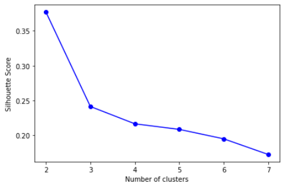

# 分析具時間序列比特幣 (Bitcoin) 價格曲線

**大綱**

* 收集資料
   * k-means
* 準備數據
* 選擇模型
  * LSTM & TCN
* 訓練機器、評估分析、調整參數
* 預測推論
  * 皮爾森函數
* 結論
* 未來改進方向

## 收集資料

**特徵值**

* 基本面 : 比特幣收盤價及收盤價、高低點、每小時交易量、收益率和對數收益率**(Log Return)**
* 市場面 : **SOPR**(支出產出利潤率)、 **Funding Rate** (資金費率)
* 消息面 : **Google trend**(搜尋趨勢)

**log return**

> K-means分群
> 
> 根據 log return做分群
> 
> 
> 
> 分五群結果如下
> 
> 
> 
> 
> 
> 
> 
> 可以分成五種波形，但無法直接對應到樂觀、相對樂觀、持平、相對悲觀、悲觀

> **SOPR** (Spent Output Profit Ratio)
> 
> 
> 
> SOPR 的計算方法是將已花費輸出的已實現價值除以UTXO的原始創建價值
> 
> SOPR（支出產出利潤率）指標提供對特定時間範圍內宏觀市場情緒、盈利能力和損失的洞察。它反映了所有在鏈上移動的代幣的已實現利潤程度。
> 
> SOPR 的衡量方法是僅考慮在所考慮的時間範圍內移動的硬幣，並取 UTXO 創建時的法幣值與 UTXO 被花費時的法幣值之間的比率。
> 
> 可以在以下框架內考慮 SOPR 指標：
> 
> **SOPR 值大於 1**意味著當天移動的硬幣平均以利潤出售
> 
> （出售的價格大於支付的價格）。
> 
> **SOPR 值小於 1**意味著當天移動的代幣平均虧本出售
> 
> （出售價格低於支付價格）。
> 
> **SOPR 值恰好為 1**意味著當天移動的代幣平均在收支平衡時出售代幣。
> 
> **SOPR 趨勢更高**意味著利潤正在實現，之前非流動性供應可能會重新回到流動性循環中
> 
> **SOPR 趨於下降**意味著正在實現損失和/或沒有使用有利可圖的硬幣。
> 
> 

> Google Trend(每小時) : 
> 
> Google 搜尋 bitcoin的次數
> 
> 時間區段一個月內可以獲取每小時的搜尋數量，超過一個月則是可以獲得每天的搜尋趨勢。

> Funding rate 資金費率(每八小時) : 
> 
> 資金費率是交易者之間為使永續合約價格接近指數價格而定期支付的費用，也可以顯示部分市場情緒。

## 準備數據

資料預處理 : 

* 統一時間規格並根據時間將數值合併

    AM/PM 處理、八小時及一天的資料判斷合併

* 缺漏的部分直接排除

    極少數小時單位的資料缺漏

* 多餘的資料則取最新的

    Google trend為時間區段百分比，所以不同時間區段會有不同結果

* 標準化

    全部標準化為1~-1的數值

## 選擇模型

LSTM : 長短期記憶 Long Short-Term Memory

是一種時間循環神經網路（RNN）

TCN : 時間卷積網絡 Temporal Convolution Network

||**LSTM**|**TCN**|
| :- | :-: | :-: |
|
**Input Output**

**(dimension)**
|**Customize**|**Consistent**|
|**Base on**|**RNN**|**CNN**|
|**Publication**|**1997**|**2018**|
|**Efficient**|**slow**|**fast**|
|**Memory**|**high**|**low**|

理論上TCN相對於 LSTM使用的記憶體應該較少， LSTM需要使用大量記憶體來存儲單元狀態，而TCN中特徵的反向傳播只取決於網絡深度。

TCN 可以利用並行性，因為它們可以並行執行卷積。

## 訓練機器、評估分析、調整參數
### LSTM
> 輸入輸出維度
>   * 168 – 1 : 前一個禮拜的資料預測下一個小時的價格
>   * 168 – 24 : 前一個禮拜的資料預測下一天的價格
>   * 168 – 168 : 前一個禮拜的資料預測下一個禮拜的價格
>   * 672 – 168 : 前四個禮拜的資料預測下一個禮拜的價格

> 時間推移
>   1) 每小時
>   1) 每八小時
>   1) 每天
>   1) 其他

> 切分訓練集、驗證集和測試集
>   取1/8為測試集，再取訓練集的1/10為驗證集

> 評估分析
> 
> 主要根據loss(訓練損失)及val\_loss(驗證損失)走勢做調整
> 
> 

> 調整參數
>   1) 數據集 : 時間區間(起訖日和訓練、驗證及測試集切分)、時間推移
>   1) 模型參數 : 節點數，drop out比例
>   1) 訓練參數 : epoch 、 batch size

> 最初使用時以168預測接下來一個點，結果如下圖 : 
> 
> 
> 
> 發現波動基本符合，但後來發現其中有誤區，因為使用於預測的資料皆是實際數據，不會因為第一個預測結果而影響後續，這個預測就不具真實性。
> 
> 所以後續加入 muti-step的方法，實際以前168個點預測接下來的價格。
> 
> 目標是預測出未來168個點(168個小時)，最初考慮的預估方法為下

> 168 – 1
> 
> 
> 
> 價格曲線平滑，可以參考走勢，但高低點不具參考性。

> 168 – 24
> 
> 
> 
> 波形重複，基本不具參考性。

> 168 – 168
> 
> 
> 
> 波形及高底點相對具參考性，故選擇168 – 168繼續調整參數。

Move window選擇8效果最好，分析是因為特徵Funding rate區間為8小時

問題處理
  1) 預估的起始點總是有落差(整體低1/10)，發現是標準化方法問題，調整後排除

  1) Muti-step預測誤區，必須預測出所有特徵值並後續推移

### TCN
1. 輸入輸出維度

  一次性輸入168筆資料，維度為10，用前一個禮拜的資料預測下一個小時的	資料

1. 時間推移

  每小時

1. 切分訓練資料18個月，驗證資料2個月，測試資料一個月
1. 評估分析

  loss(訓練損失)及val\_loss(驗證損失)走勢做調整

1. 調整參數/資料

  進168出168

  推測可能是因為訓練資料的時間區段在202001-202110，

  造成輸入大多資料都呈現多頭趨勢，較難反應價格走勢。

  

  進168出1

  此圖片為不斷調整模型的價格預測。

  

## 預測推論

皮爾森函數

LSTM 

168-168 (0.085)

168-1   (0.28)

TCN

進168出1，使用最後一組模型預測的結果為-0.0276，低度相關

每週的分群結果

## 結論

LSTM以168推算168的結果很不理想，和實際資料相關性趨近於零，等於不相關，而在168推算1的結果中，實測三個禮拜有會有一個禮拜成功預估趨勢，但曲線平滑沒有高低點。

RNN在預測價格方面，如果價格在短時間內發生劇烈波動，會沒有辦法反應價格波動。

TCN以168出1的結論的結果也不理想，在近4週的預測中相關係數有兩週約為-0.5，一週約為-0.3，一週約0.5，一週約0.75，跑出結果為低度相關。

##未來改進方向
1) 特徵值選擇及分析

獲取更具代表性的特徵值，分析特徵值和目標的相關性。

由於google trend無法得知市場情緒，只能了解當下市場熱度，改進方向可能是在twitter獲取市場熱度以及市場情緒，做為市場面/消息面的其中一項依據。

基本面可以加入更多的特徵值，如基準利率或者公債殖利率等。

使用RFE(recursive feature elimination)等特徵篩選，確保選取的特徵值有助於我們模型訓練。

選擇時應對特徵值進行評估，判斷對預測結果的相關性。

1) 資料預處理(去極值、標準化)

根據資料特性做不同的處理，去極值、標準化，像是SOPR就應做去噪處理

1) Muti-step可以使用雙模組

一個預估特徵值，另一個推估目標價格

1) 預測結果分析若用皮爾森函數評估，應將價格轉為simple return    
1) 訓練模組可以調整更多參數(optimizer、 losses)，以及做更多評估才能更客觀有利的比較模組優劣。  

資料來源

1) Binance

<https://www.cryptodatadownload.com/data/binance/>

<https://www.binance.com/en/futures/funding-history/1>

1) Glassnode

免費帳號限制多，大多數據皆須付費，顆粒度更細的資料也需付費

[https://studio.glassnode.com/](https://studio.glassnode.com/metrics?a=BTC&category=Market%20Indicators&m=indicators.Sopr&s=1577836800&u=1637539199&zoom=)

1) Google Trend

Pytrends 套件

<https://github.com/GeneralMills/pytrends>

